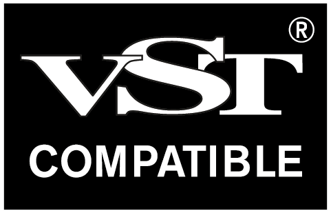

# VL.Audio.VST
Use VST 3 instruments and effects and control them via input parameters or MIDI. 

VST® is a trademark of [Steinberg Media Technologies GmbH](https://www.steinberg.net/), registered in Europe and other countries.

For use with vvvv, the visual live-programming environment for .NET: http://visualprogramming.net

> [!IMPORTANT]
> While this package itself is published under the LGPL-3.0, when releasing an app using it, you also must comply with [VST 3 licensing](https://steinbergmedia.github.io/vst3_dev_portal/pages/VST+3+Licensing/What+are+the+licensing+options.html)!

 
Implementation Status

Compare [VST 3 Technical Documentation](https://steinbergmedia.github.io/vst3_dev_portal/pages/Technical+Documentation/Index.html)

| Implemented Interfaces | Status  |
| ------------- | ------------- |
| IAttributeList | done |
| IComponentHandler | parameter editing yes, restart calls some |
| IEventList | done |
| IUnitHandler | done |
| IHostApplication | done |
| IMessage | done |
| IParamValueQueue | done |
| IParameterChanges | done |
| IPlugFrame | done |

| Consumed Interfaces (from the plugin) | Status  |
| ------------- | ------------- |
| IComponent | state yes, bus count and info only main, IO mode no |
| IAudioProcessor | only stereo tested so far |
| IEditController | done |
| IConnectionPoint | yes, using a connection proxy which ensures any notifications are done on main thread |
| IUnitInfo | used to build display name of pins, also used in case of dynamic reflection |
| IProgramListData | no |
| IUnitData | no |
| IPlugView | sizing yes, keyboard handling no |

| Additional | Status  |
| ------------- | ------------- |
| Multiple Dynamic I/O Support | no |
| Silence flags | no |
| Parameter MIDI Mapping | yes |
| Parameter Finder | no - did have a look but found no plugin implementing it |
| Audio Presentation Latency | no |
| Dirty State, Open Editor Request and UI Group Editing Support | dirty state yes, rest no |
| KnobMode, Open Help & Open Aboutbox | no |
| Note Expression | no |
| Key Switch | no |
| Remote Presentation of Parameters | no |
| Context Menu | no |
| Enhanced Linked Parameters | no |
| iOS Inter-App Audio | no |
| Preset Meta-Information | no |
| Channel Context Info | no |
| Unit-Bus Assignment Change | no |
| Prefetchable | no |
| Automation State | no |
| PlugView Content Scaling | yes |
| Request Bus Activation | no |
| UI Snapshots | no |
| NoteExpression Physical UI Mapping | no |
| Legacy MIDI CC Out Event | yes |
| MIDI Learn | yes |
| Host Query Interface support | yes |
| MPE support for Wrappers | no |
| Parameter Function Name | no |
| Progress display | no |
| Process Context Requirements | no |
| Control Voltage Bus Flag | no |
| Module Info and Plug-in Compatibility | no |
| Get Current SystemTime | no |
| Process  Requirements | no |
| Data Transfert Between Processor/Controller | no |
| Remap Parameter ID | no |

 

## Getting started
- Install as [described here](https://thegraybook.vvvv.org/reference/hde/managing-nugets.html) via commandline:

    `nuget install VL.Audio.VST -pre -source https://nuget.pkg.github.com/vvvv/index.json;nuget.org`

- Install some VSTs. They will automatically show up in the nodebrowser when installed in the default location `\Program Files\Common Files\VST3\` or when found in a `\VST3` folder next to your .vl document. Adding a VST requires a restart of vvvv.
- Usage examples and more information are included in the pack and can be found via the [Help Browser](https://thegraybook.vvvv.org/reference/hde/findinghelp.html)

## Contributing
- Report issues on [the vvvv forum](https://discourse.vvvv.org/c/vvvv-gamma/28)
- For custom development requests, please [get in touch](mailto:devvvvs@vvvv.org)
- When making a pull-request, please make sure to read the general [guidelines on contributing to vvvv libraries](https://thegraybook.vvvv.org/reference/extending/contributing.html)

## Sponsoring
Development of this library was partially sponsored by:  
* [m box](https://www.m-box.de/)
* [SCHNELLE BUNTE BILDER](https://schnellebuntebilder.de/)
* [3e8.studio](https://3e8.studio/)
